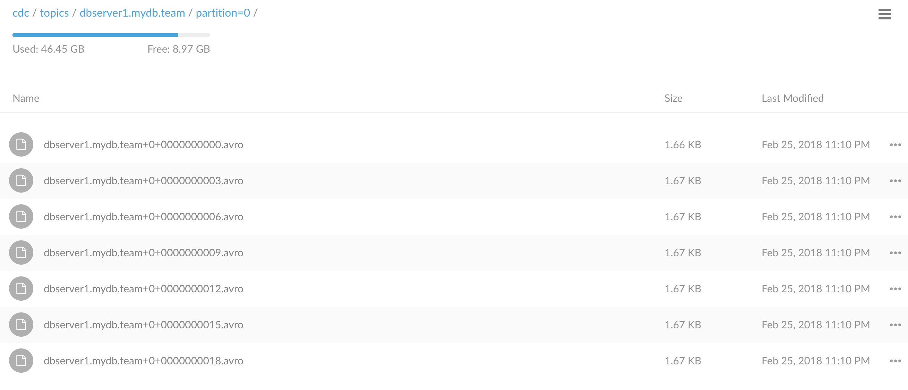

# Objective 

Getting CDC to S3 

```
$ docker-compose exec connect curl  -XPOST -H "Content-Type: application/json; charset=UTF-8" http://localhost:8083/connectors/ -d '
{
    "name": "debezium-connector",
    "config": {
        "connector.class": "io.debezium.connector.mysql.MySqlConnector",
        "tasks.max": "1",
        "database.hostname": "mysql",
        "database.port": "3306",
        "database.user": "debezium",
        "database.password": "dbz",
        "database.server.id": "223344",
        "database.server.name": "dbserver1",
        "database.whitelist": "mydb",
        "database.history.kafka.bootstrap.servers": "kafka-1:9092,kafka-2:9092,kafka-3:9092",
        "database.history.kafka.topic": "schema-changes.mydb"
    }
}'
```

Let's see if we have our topic 

```sh 
$ docker-compose exec kafka-1 kafka-topics --zookeeper zookeeper:2181 --list
  __consumer_offsets
  _schemas
  connect-config
  connect-offsets
  connect-status
  dbserver1
  dbserver1.mydb.team
  schema-changes.mydb
```


Let's add some dummy data

```
for i in {1..20} ; do
    docker-compose exec mysql mysql --user=root --password=password --database=mydb -e "
    INSERT INTO team (   \
      name, \
      email,   \
      last_modified \
    ) VALUES (  \
      'another',  \
      'another@apache.org',   \
      NOW() \
    ); "
done
```

Let's dig into out team topic

```
$ docker-compose exec schema-registry kafka-avro-console-consumer -bootstrap-server kafka-1:9092,kafka-2:9092,kafka-3:9092 --topic dbserver1.mydb.team --from-beginning --property schema.registry.url=http://localhost:8082
{"before":null,"after":{"dbserver1.mydb.team.Value":{"id":1,"name":"kafka","email":"kafka@apache.org","last_modified":1519596446000}},"source":{"version":{"string":"0.7.3"},"name":"dbserver1","server_id":0,"ts_sec":0,"gtid":null,"file":"mysql-bin.000003","pos":154,"row":0,"snapshot":{"boolean":true},"thread":null,"db":{"string":"mydb"},"table":{"string":"team"}},"op":"c","ts_ms":{"long":1519596501902}}
{"before":null,"after":{"dbserver1.mydb.team.Value":{"id":2,"name":"another","email":"another@apache.org","last_modified":1519596522000}},"source":{"version":{"string":"0.7.3"},"name":"dbserver1","server_id":223344,"ts_sec":1519596522,"gtid":null,"file":"mysql-bin.000003","pos":354,"row":0,"snapshot":null,"thread":{"long":7},"db":{"string":"mydb"},"table":{"string":"team"}},"op":"c","ts_ms":{"long":1519596522162}}
{"before":null,"after":{"dbserver1.mydb.team.Value":{"id":3,"name":"another","email":"another@apache.org","last_modified":1519596522000}},"source":{"version":{"string":"0.7.3"},"name":"dbserver1","server_id":223344,"ts_sec":1519596522,"gtid":null,"file":"mysql-bin.000003","pos":657,"row":0,"snapshot":null,"thread":{"long":8},"db":{"string":"mydb"},"table":{"string":"team"}},"op":"c","ts_ms":{"long":1519596522715}}
{"before":null,"after":{"dbserver1.mydb.team.Value":{"id":4,"name":"another","email":"another@apache.org","last_modified":1519596523000}},"source":{"version":{"string":"0.7.3"},"name":"dbserver1","server_id":223344,"ts_sec":1519596523,"gtid":null,"file":"mysql-bin.000003","pos":960,"row":0,"snapshot":null,"thread":{"long":9},"db":{"string":"mydb"},"table":{"string":"team"}},"op":"c","ts_ms":{"long":1519596523316}}
{"before":null,"after":{"dbserver1.mydb.team.Value":{"id":5,"name":"another","email":"another@apache.org","last_modified":1519596523000}},"source":{"version":{"string":"0.7.3"},"name":"dbserver1","server_id":223344,"ts_sec":1519596523,"gtid":null,"file":"mysql-bin.000003","pos":1263,"row":0,"snapshot":null,"thread":{"long":10},"db":{"string":"mydb"},"table":{"string":"team"}},"op":"c","ts_ms":{"long":1519596523846}}
{"before":null,"after":{"dbserver1.mydb.team.Value":{"id":6,"name":"another","email":"another@apache.org","last_modified":1519596524000}},"source":{"version":{"string":"0.7.3"},"name":"dbserver1","server_id":223344,"ts_sec":1519596524,"gtid":null,"file":"mysql-bin.000003","pos":1566,"row":0,"snapshot":null,"thread":{"long":11},"db":{"string":"mydb"},"table":{"string":"team"}},"op":"c","ts_ms":{"long":1519596524363}}
{"before":null,"after":{"dbserver1.mydb.team.Value":{"id":7,"name":"another","email":"another@apache.org","last_modified":1519596525000}},"source":{"version":{"string":"0.7.3"},"name":"dbserver1","server_id":223344,"ts_sec":1519596525,"gtid":null,"file":"mysql-bin.000003","pos":1869,"row":0,"snapshot":null,"thread":{"long":12},"db":{"string":"mydb"},"table":{"string":"team"}},"op":"c","ts_ms":{"long":1519596525348}}
{"before":null,"after":{"dbserver1.mydb.team.Value":{"id":8,"name":"another","email":"another@apache.org","last_modified":1519596526000}},"source":{"version":{"string":"0.7.3"},"name":"dbserver1","server_id":223344,"ts_sec":1519596526,"gtid":null,"file":"mysql-bin.000003","pos":2172,"row":0,"snapshot":null,"thread":{"long":13},"db":{"string":"mydb"},"table":{"string":"team"}},"op":"c","ts_ms":{"long":1519596526129}}
{"before":null,"after":{"dbserver1.mydb.team.Value":{"id":9,"name":"another","email":"another@apache.org","last_modified":1519596526000}},"source":{"version":{"string":"0.7.3"},"name":"dbserver1","server_id":223344,"ts_sec":1519596526,"gtid":null,"file":"mysql-bin.000003","pos":2475,"row":0,"snapshot":null,"thread":{"long":14},"db":{"string":"mydb"},"table":{"string":"team"}},"op":"c","ts_ms":{"long":1519596526734}}
{"before":null,"after":{"dbserver1.mydb.team.Value":{"id":10,"name":"another","email":"another@apache.org","last_modified":1519596527000}},"source":{"version":{"string":"0.7.3"},"name":"dbserver1","server_id":223344,"ts_sec":1519596527,"gtid":null,"file":"mysql-bin.000003","pos":2778,"row":0,"snapshot":null,"thread":{"long":15},"db":{"string":"mydb"},"table":{"string":"team"}},"op":"c","ts_ms":{"long":1519596527433}}
{"before":null,"after":{"dbserver1.mydb.team.Value":{"id":11,"name":"another","email":"another@apache.org","last_modified":1519596528000}},"source":{"version":{"string":"0.7.3"},"name":"dbserver1","server_id":223344,"ts_sec":1519596528,"gtid":null,"file":"mysql-bin.000003","pos":3081,"row":0,"snapshot":null,"thread":{"long":16},"db":{"string":"mydb"},"table":{"string":"team"}},"op":"c","ts_ms":{"long":1519596528082}}
{"before":null,"after":{"dbserver1.mydb.team.Value":{"id":12,"name":"another","email":"another@apache.org","last_modified":1519596528000}},"source":{"version":{"string":"0.7.3"},"name":"dbserver1","server_id":223344,"ts_sec":1519596528,"gtid":null,"file":"mysql-bin.000003","pos":3384,"row":0,"snapshot":null,"thread":{"long":17},"db":{"string":"mydb"},"table":{"string":"team"}},"op":"c","ts_ms":{"long":1519596528756}}
{"before":null,"after":{"dbserver1.mydb.team.Value":{"id":13,"name":"another","email":"another@apache.org","last_modified":1519596529000}},"source":{"version":{"string":"0.7.3"},"name":"dbserver1","server_id":223344,"ts_sec":1519596529,"gtid":null,"file":"mysql-bin.000003","pos":3687,"row":0,"snapshot":null,"thread":{"long":18},"db":{"string":"mydb"},"table":{"string":"team"}},"op":"c","ts_ms":{"long":1519596529420}}
{"before":null,"after":{"dbserver1.mydb.team.Value":{"id":14,"name":"another","email":"another@apache.org","last_modified":1519596530000}},"source":{"version":{"string":"0.7.3"},"name":"dbserver1","server_id":223344,"ts_sec":1519596530,"gtid":null,"file":"mysql-bin.000003","pos":3990,"row":0,"snapshot":null,"thread":{"long":19},"db":{"string":"mydb"},"table":{"string":"team"}},"op":"c","ts_ms":{"long":1519596530068}}
{"before":null,"after":{"dbserver1.mydb.team.Value":{"id":15,"name":"another","email":"another@apache.org","last_modified":1519596530000}},"source":{"version":{"string":"0.7.3"},"name":"dbserver1","server_id":223344,"ts_sec":1519596530,"gtid":null,"file":"mysql-bin.000003","pos":4293,"row":0,"snapshot":null,"thread":{"long":20},"db":{"string":"mydb"},"table":{"string":"team"}},"op":"c","ts_ms":{"long":1519596530597}}
{"before":null,"after":{"dbserver1.mydb.team.Value":{"id":16,"name":"another","email":"another@apache.org","last_modified":1519596531000}},"source":{"version":{"string":"0.7.3"},"name":"dbserver1","server_id":223344,"ts_sec":1519596531,"gtid":null,"file":"mysql-bin.000003","pos":4596,"row":0,"snapshot":null,"thread":{"long":21},"db":{"string":"mydb"},"table":{"string":"team"}},"op":"c","ts_ms":{"long":1519596531118}}
{"before":null,"after":{"dbserver1.mydb.team.Value":{"id":17,"name":"another","email":"another@apache.org","last_modified":1519596531000}},"source":{"version":{"string":"0.7.3"},"name":"dbserver1","server_id":223344,"ts_sec":1519596531,"gtid":null,"file":"mysql-bin.000003","pos":4899,"row":0,"snapshot":null,"thread":{"long":22},"db":{"string":"mydb"},"table":{"string":"team"}},"op":"c","ts_ms":{"long":1519596531674}}
{"before":null,"after":{"dbserver1.mydb.team.Value":{"id":18,"name":"another","email":"another@apache.org","last_modified":1519596532000}},"source":{"version":{"string":"0.7.3"},"name":"dbserver1","server_id":223344,"ts_sec":1519596532,"gtid":null,"file":"mysql-bin.000003","pos":5202,"row":0,"snapshot":null,"thread":{"long":23},"db":{"string":"mydb"},"table":{"string":"team"}},"op":"c","ts_ms":{"long":1519596532236}}
{"before":null,"after":{"dbserver1.mydb.team.Value":{"id":19,"name":"another","email":"another@apache.org","last_modified":1519596532000}},"source":{"version":{"string":"0.7.3"},"name":"dbserver1","server_id":223344,"ts_sec":1519596532,"gtid":null,"file":"mysql-bin.000003","pos":5505,"row":0,"snapshot":null,"thread":{"long":24},"db":{"string":"mydb"},"table":{"string":"team"}},"op":"c","ts_ms":{"long":1519596532749}}
{"before":null,"after":{"dbserver1.mydb.team.Value":{"id":20,"name":"another","email":"another@apache.org","last_modified":1519596533000}},"source":{"version":{"string":"0.7.3"},"name":"dbserver1","server_id":223344,"ts_sec":1519596533,"gtid":null,"file":"mysql-bin.000003","pos":5808,"row":0,"snapshot":null,"thread":{"long":25},"db":{"string":"mydb"},"table":{"string":"team"}},"op":"c","ts_ms":{"long":1519596533261}}
{"before":null,"after":{"dbserver1.mydb.team.Value":{"id":21,"name":"another","email":"another@apache.org","last_modified":1519596533000}},"source":{"version":{"string":"0.7.3"},"name":"dbserver1","server_id":223344,"ts_sec":1519596533,"gtid":null,"file":"mysql-bin.000003","pos":6111,"row":0,"snapshot":null,"thread":{"long":26},"db":{"string":"mydb"},"table":{"string":"team"}},"op":"c","ts_ms":{"long":1519596533807}}```
```

Create the S3 bucket

```
$ docker-compose up create-buckets
$ docker-compose logs create-buckets
```

Look into http://localhost:9000 to see minio in action.


Start the S3 connector

```
$ docker-compose exec connect curl  -XPOST -H "Content-Type: application/json; charset=UTF-8" http://localhost:8083/connectors/ -d '
{
    "name": "s3-sink",
    "config": {
        "connector.class": "io.confluent.connect.s3.S3SinkConnector",
        "tasks.max": "1",
        "topics": "dbserver1.mydb.team",
        "s3.bucket.name": "cdc",
        "s3.part.size": "5242880",
        "store.url": "http://minio:9000",
        "flush.size": "3",
        "storage.class": "io.confluent.connect.s3.storage.S3Storage",
        "format.class": "io.confluent.connect.s3.format.avro.AvroFormat",
        "schema.generator.class": "io.confluent.connect.storage.hive.schema.DefaultSchemaGenerator",
        "partitioner.class": "io.confluent.connect.storage.partitioner.DefaultPartitioner",
        "schema.compatibility": "NONE",
        "name": "s3-sink"
    }
}'
```

Let's see its status
 
```sh
$ docker-compose exec connect curl -s localhost:8083/connectors/s3-sink/status | jq .
{
  "name": "s3-sink",
  "connector": {
    "state": "RUNNING",
    "worker_id": "connect:8083"
  },
  "tasks": [
    {
      "state": "RUNNING",
      "id": 0,
      "worker_id": "connect:8083"
    }
  ],
  "type": "sink"
}
```
 

Let's list the S3 bucket

```
$ docker-compose restart list-buckets
$ docker-compose logs list-buckets
list-buckets_1     | Added `myminio` successfully.
list-buckets_1     | [2018-02-25 21:34:32 UTC] 1.7KiB topics/dbserver1.mydb.team/partition=0/dbserver1.mydb.team+0+0000000000.avro
list-buckets_1     | [2018-02-25 21:34:33 UTC] 1.7KiB topics/dbserver1.mydb.team/partition=0/dbserver1.mydb.team+0+0000000003.avro
list-buckets_1     | [2018-02-25 21:34:34 UTC] 1.7KiB topics/dbserver1.mydb.team/partition=0/dbserver1.mydb.team+0+0000000006.avro
list-buckets_1     | [2018-02-25 21:34:37 UTC] 1.7KiB topics/dbserver1.mydb.team/partition=0/dbserver1.mydb.team+0+0000000009.avro
list-buckets_1     | [2018-02-25 21:34:39 UTC] 1.7KiB topics/dbserver1.mydb.team/partition=0/dbserver1.mydb.team+0+0000000012.avro
list-buckets_1     | [2018-02-25 21:34:41 UTC] 1.7KiB topics/dbserver1.mydb.team/partition=0/dbserver1.mydb.team+0+0000000015.avro
```

In minio :




Perfect!

# The full action ?

[](https://asciinema.org/a/q0XtZntXV58NknefCNggOYRCz?autoplay=1)
