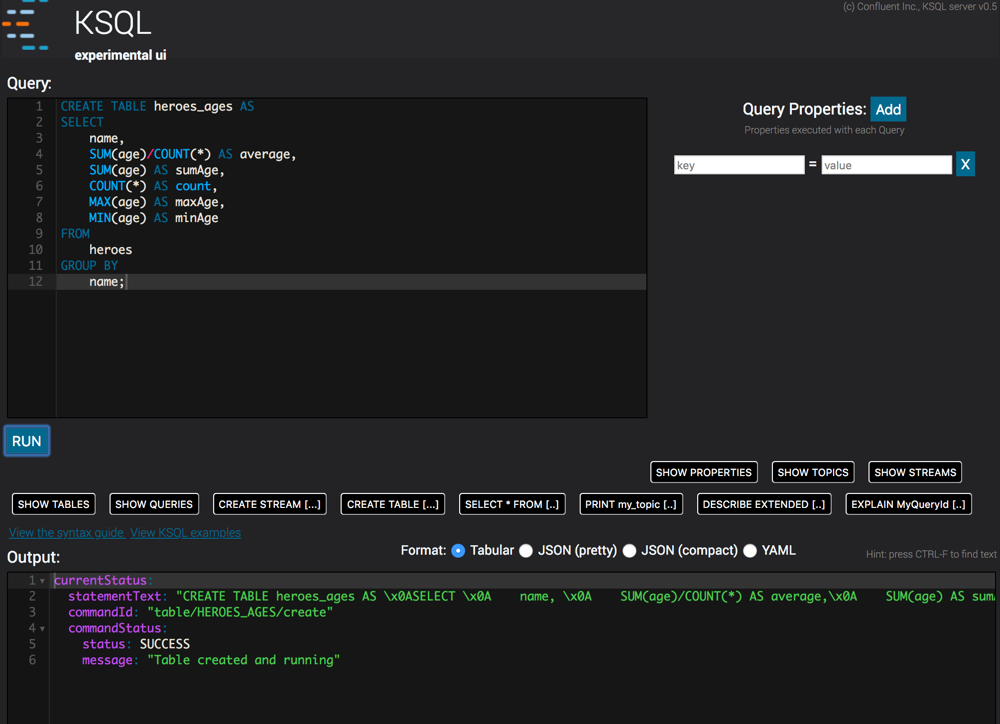
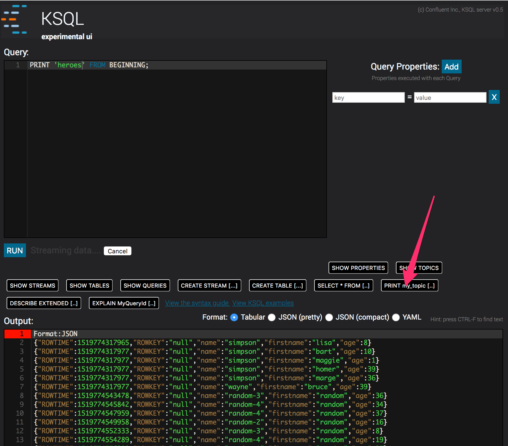
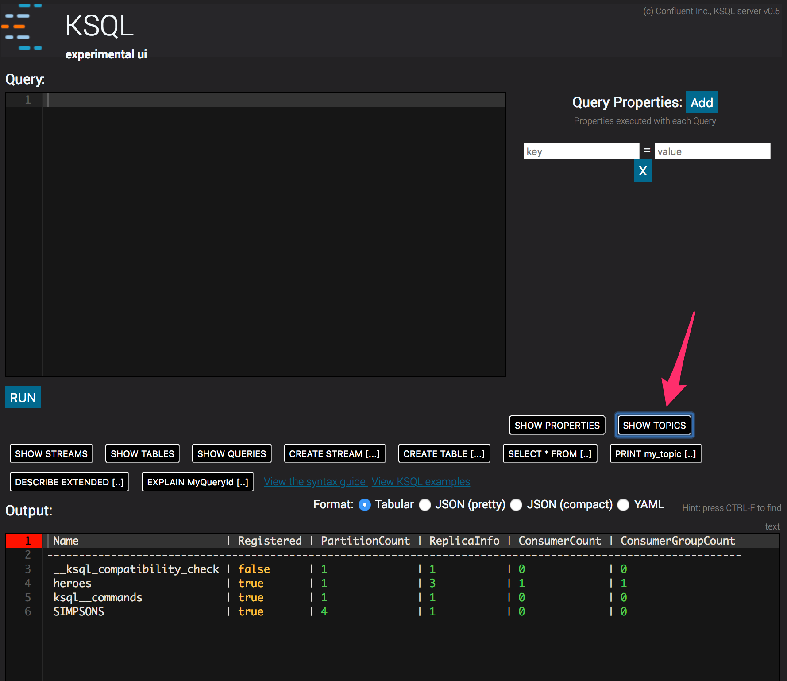

# Objective 

Enter remote ksql and UI

Run the cli to connect to the server

```
$ docker-compose exec ksql-cli ksql-cli remote http://ksql-server:8080
KSQL, Copyright 2017 Confluent Inc.

CLI v0.5, Server v0.5 located at http://ksql-server:8080

Having trouble? Type 'help' (case-insensitive) for a rundown of how things work!

ksql>
```

You can also use the UI at http://localhost:8080






