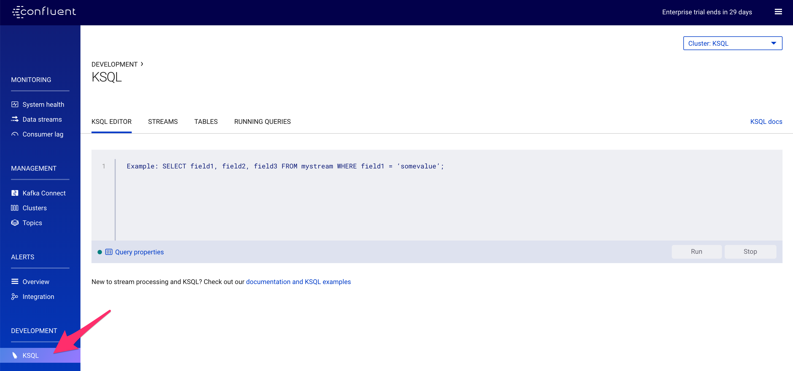
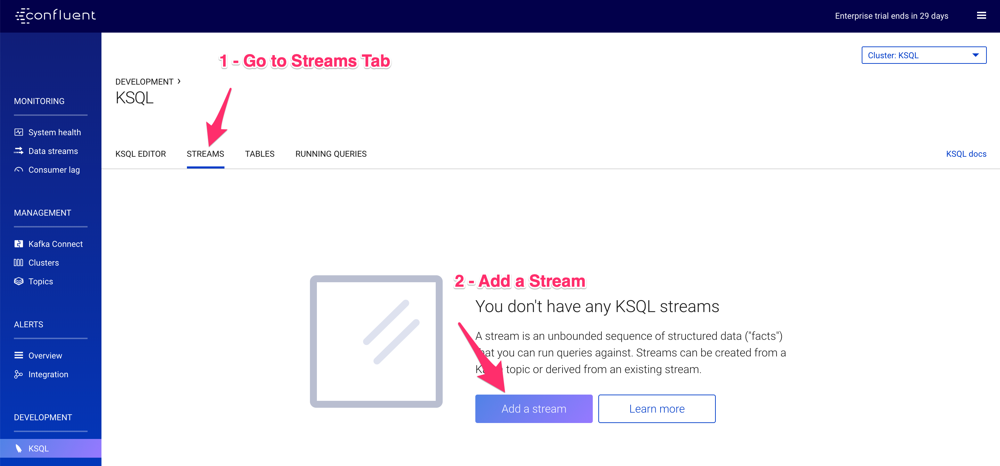
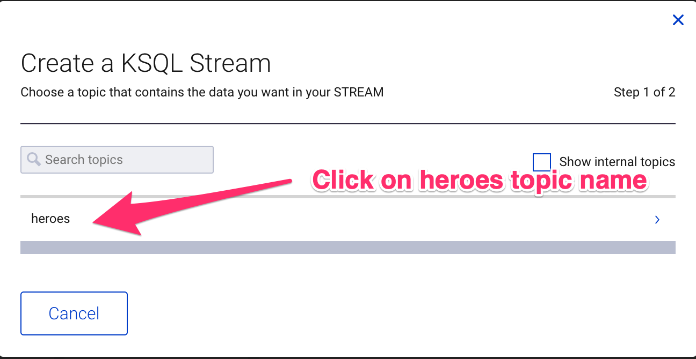
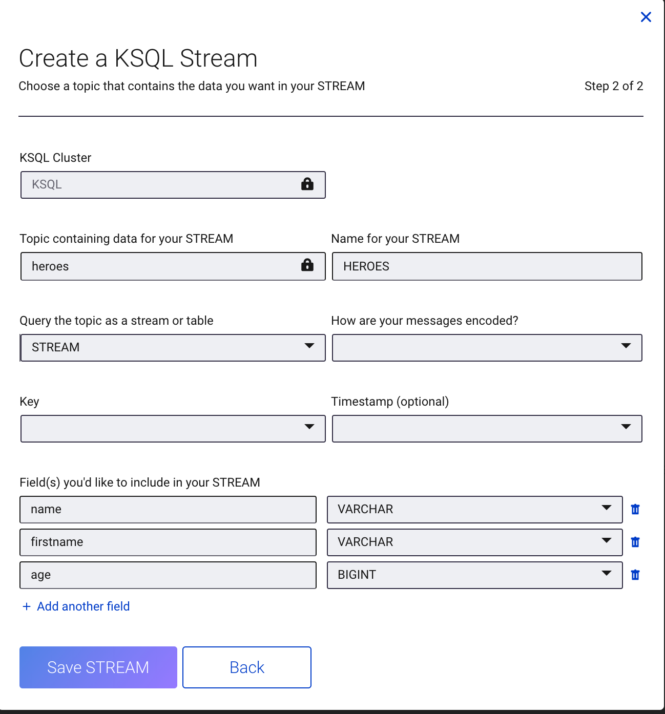
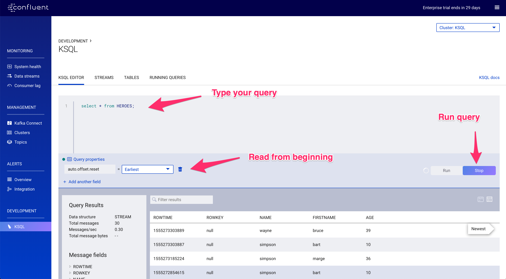

# Objective 

Create Streams, query streams from UI

Access the Control Center UI at http://localhost:9021

On the left menu click on KSQL

Click `streams` tab, then on `Add a stream` Button

`

Select the source topic for the stream

Configure the Stream

**IMPORTANT: Don't forget to fill `How are your message encoded?``**

Note that Control Center discovered all the field !

Let's query the result !

