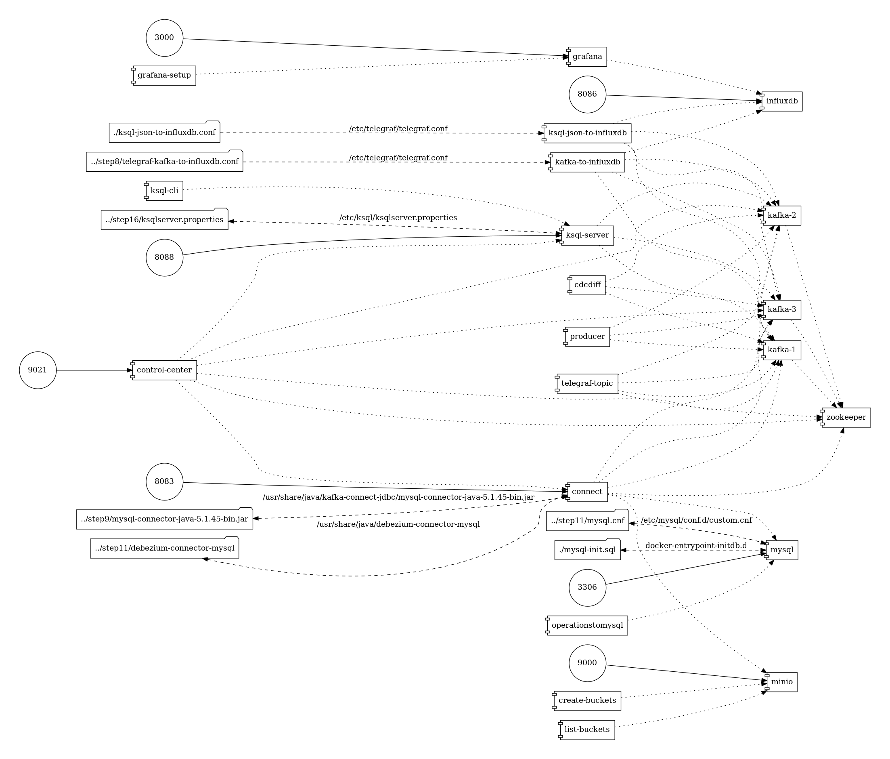

# Objective

# Enable CDC
```sh

docker-compose exec connect curl  -XDELETE -H "Content-Type: application/json; charset=UTF-8" http://localhost:8083/connectors/debezium-connector

$ docker-compose exec connect curl -s -XPOST -H "Content-Type: application/json; charset=UTF-8" http://localhost:8083/connectors/ -d '
{
    "name": "debezium-connector",
    "config": {
        "connector.class": "io.debezium.connector.mysql.MySqlConnector",
        "tasks.max": "1",
        "database.hostname": "mysql",
        "database.port": "3306",
        "database.user": "debezium",
        "database.password": "dbz",
        "database.server.id": "1",
        "database.server.name": "dbserver1",
        "database.whitelist": "mydb",
        "database.history.kafka.bootstrap.servers": "kafka-1:9092,kafka-2:9092,kafka-3:9092",
        "database.history.kafka.topic": "schema-changes.mydb",
        "include.schema.changes": "false" ,
        "value.converter": "org.apache.kafka.connect.json.JsonConverter",
        "value.converter.schemas.enable": false,
        "key.converter": "org.apache.kafka.connect.json.JsonConverter",
        "key.converter.schemas.enable": false    
      }        
}'
```

# Enable Push to S3!

```
docker-compose exec connect curl  -XDELETE -H "Content-Type: application/json; charset=UTF-8" http://localhost:8083/connectors/s3-sink
$ docker-compose exec connect curl  -XPOST -H "Content-Type: application/json; charset=UTF-8" http://localhost:8083/connectors/ -d '
{
    "name": "s3-sink",
    "config": {
        "connector.class": "io.confluent.connect.s3.S3SinkConnector",
        "tasks.max": "1",
        "topics.regex": "dbserver1.mydb.*",
        "s3.bucket.name": "cdc",
        "s3.part.size": "5242880",
        "store.url": "http://minio:9000",
        "flush.size": "3",
        "storage.class": "io.confluent.connect.s3.storage.S3Storage",
        "format.class": "io.confluent.connect.s3.format.json.JsonFormat",
        "schema.generator.class": "io.confluent.connect.storage.hive.schema.DefaultSchemaGenerator",
        "partitioner.class": "io.confluent.connect.storage.partitioner.DefaultPartitioner",
        "schema.compatibility": "NONE",
        "name": "s3-sink",
        "value.converter": "org.apache.kafka.connect.json.JsonConverter",
        "value.converter.schemas.enable": false,
        "key.converter": "org.apache.kafka.connect.json.JsonConverter",
        "key.converter.schemas.enable": false    
    }
}'
```


Show graph dependencies
```
$ docker run --rm -it --name dcv -v $(pwd):/input pmsipilot/docker-compose-viz render --horizontal --output-format image --no-volumes --force docker-compose.yml
```




Show graph dependencies with volumes

```
$ docker run --rm -it --name dcv -v $(pwd):/input pmsipilot/docker-compose-viz render --horizontal --output-format image --force docker-compose.yml
```

# Ksql

```
$ docker-compose exec ksql-cli ksql http://ksql-server:8088
```

```sql
CREATE STREAM OPERATIONS (operation varchar, class varchar) \
    WITH ( kafka_topic='RandomProducerAction',value_format='JSON');

CREATE TABLE "BY_OPERATION" WITH (PARTITIONS=1) AS \
SELECT operation, count(*) as count \
FROM OPERATIONS \
WINDOW TUMBLING (SIZE 20 SECONDS) \
GROUP BY operation;

CREATE TABLE "BY-CLASS" AS \
SELECT class, count(*) as count \
FROM OPERATIONS \
WINDOW TUMBLING (SIZE 20 SECONDS) \
GROUP BY class;
```
