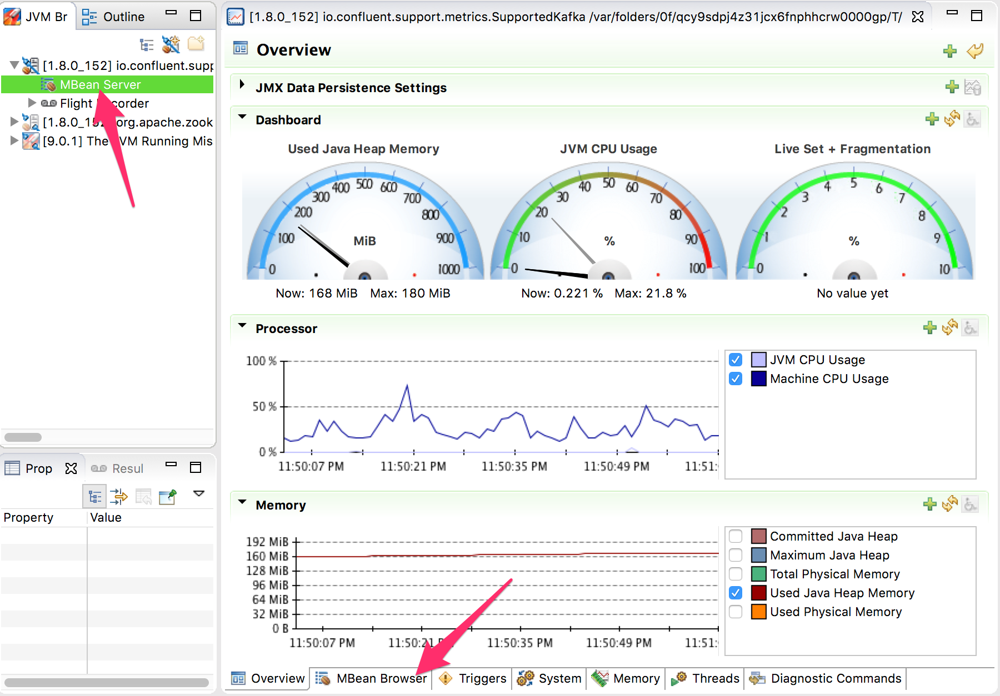
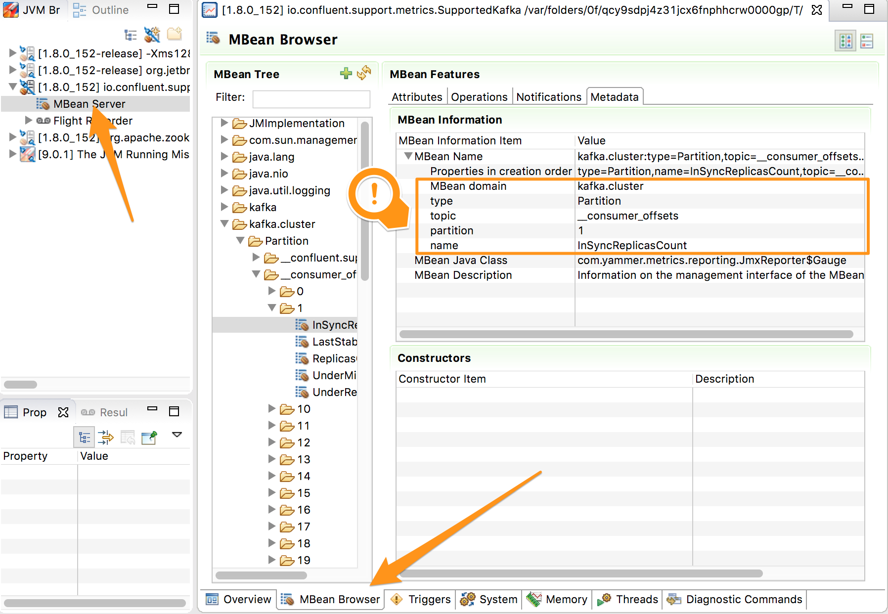

# Objective 

Capture JMX metrics via Jolokia and Telegraf.


# Jolokia 

Jolokia is a tool to access the JMX metrics via HTTP. This is especially useful for non jvm languages such as go.

Telegraf can access JMX metrics only via http, thus the need for jolokia.

# Jmx desktop browser

In order to see the JMX metrics, you can use the venerable [jconsole](https://docs.oracle.com/javase/7/docs/technotes/guides/management/jconsole.html), or a much better tool that is shipped with JDK8 [Java Mission Control](http://www.oracle.com/technetwork/java/javaseproducts/mission-control/java-mission-control-1998576.html) .

To run it :

````
$ jmc &
````




# Use Jolokia to attach to a running Kafka process

This commands will 
1. download [Confluent distribution](https://www.confluent.io/download/) 
1. download [Jolokia](https://jolokia.org)
1. unzip the confluent distribution
1. start Kafka and Zookeeper
1. see all the running jvm
1. see the jolokia help output
1. connect the jolokia java agent to the running Kafka process
1. test jolokia output
1. disconnect the jolokia agent from the running Kafka process
1. stop Kafka and Zookeeper


```
wget http://packages.confluent.io/archive/4.0/confluent-4.0.0-2.11.tar.gz
wget https://repo1.maven.org/maven2/org/jolokia/jolokia-jvm/1.3.7/jolokia-jvm-1.3.7-agent.jar
tar -xf confluent-4.0.0-2.11.tar.gz
confluent-4.0.0/bin/confluent start kafka
jps
java -jar jolokia-jvm-1.3.7-agent.jar --help | head -13
java -jar jolokia-jvm-1.3.7-agent.jar start `jps | grep SupportedKafka | cut -d ' ' -f 1`
curl http://127.0.0.1:8778/jolokia/ 
java -jar jolokia-jvm-1.3.7-agent.jar stop `jps | grep SupportedKafka | cut -d ' ' -f 1`
confluent-4.0.0/bin/confluent stop
```

Here's the live version
	
[](https://asciinema.org/a/IBp8TA07QaWOm5q0cp2mA0c2L?autoplay=1)

# Telegraf

Well now we can add the [jolokia2 plugin](https://github.com/influxdata/telegraf/tree/master/plugins/inputs/jolokia2) and setup the metrics we want to gather using jolokia.

Please make sure you know how to gather tag_keys




```
[[inputs.jolokia2_agent]]
  urls = ["http://kafka-1:8778/jolokia/","http://kafka-2:8778/jolokia/","http://kafka-3:8778/jolokia/"]

[[inputs.jolokia2_agent.metric]]
  name         = "kafka_cluster_partition"
  mbean        = "kafka.cluster:type=Partition,topic=*,partition=*"
  tag_keys     = ["type","topic","partition"]
```


# Splitting the configuration

As we want to monitor

* kafka
* zookeeper
* kafka consumer
* docker

We'll split the inputs definition in multiple files

```sh
$ tree telegraf-inputs/
telegraf-inputs/
├── consumer.conf
├── docker.conf
├── kafka.conf
└── zookeeper.conf
```

we'll update add `./telegraf-inputs/:/tmp/telegraf-inputs/:ro` in the `volumes` definition.

And change the default telegraf command to `telegraf --config-directory /tmp/telegraf-inputs`

```yml
  telegraf:
    image: telegraf:1.5
    restart: unless-stopped
    volumes:
      - /var/run/docker.sock:/tmp/docker.sock
      - ./telegraf.conf:/etc/telegraf/telegraf.conf:ro
      - ./telegraf-inputs/:/tmp/telegraf-inputs/:ro
    command: telegraf --config-directory /tmp/telegraf-inputs
    depends_on:
      - zookeeper
      - kafka-1
      - kafka-2
      - kafka-3
      - consumer-1
```

# Integrating the Jolokia agent

In order to install the [jolokia agent](https://jolokia.org/agent/jvm.html) to our java application we need to set the following environment variable 

```
    KAFKA_OPTS: "-javaagent:/some_folder/jolokia.jar=host=0.0.0.0"
```

example

```yml
  consumer-1:
    image: confluentinc/cp-kafka
    hostname: consumer-3
    depends_on:
      - zookeeper
    command: kafka-console-consumer --bootstrap-server kafka-1:9092,kafka-2:9092,kafka-3:9092 --topic telegraf --from-beginning
    environment:
      KAFKA_OPTS: "-javaagent:/some_folder/jolokia.jar=host=0.0.0.0"
    depends_on:
      - kafka-1
      - kafka-2
      - kafka-3

```

That is all fine and good, but there is no `/some_folder/jolokia.jar` in the `confluentinc/cp-kafka` image.

# Docker volumes to the rescue

In order to solve this issue we'll rely on 
* the [volumes](https://docs.docker.com/compose/compose-file/compose-file-v2/#volumes) docker-compose attribute
* the [volumes_from](https://docs.docker.com/compose/compose-file/compose-file-v2/#volumes_from) docker-compose attribute
* the [jolokia/java-jolokia](https://hub.docker.com/r/jolokia/java-jolokia/) image.


```yml
version: '2'
services:
  jolokia:
    image: jolokia/java-jolokia
    volumes:
      - /opt/jolokia/
  example:
    image: alpine
    volumes_from: 
      - jolokia
    command: sh -c "echo `ls /opt/jolokia` is from an external folder"

```

Here's the output 

```
$ docker-compose -f expose-volume.yml up
Starting step7_jolokia_1 ...
Starting step7_jolokia_1 ... done
Starting step7_using_jolokia_1 ...
Starting step7_using_jolokia_1 ... done
Attaching to step7_jolokia_1, step7_using_jolokia_1
jolokia_1                 | Jolokia JVM Agent 1.3.1
using_an_external_file_1  | jolokia.jar is from an external folder
step7_jolokia_1 exited with code 0
step7_using_jolokia_1 exited with code 0

```

We can now reference the `jolokia` volume!

```
  consumer-1:
    image: confluentinc/cp-kafka
    hostname: consumer-3
    depends_on:
      - zookeeper
    command: kafka-console-consumer --bootstrap-server kafka-1:9092,kafka-2:9092,kafka-3:9092 --topic telegraf --from-beginning
    environment:
      KAFKA_OPTS: "-javaagent:/opt/jolokia/jolokia.jar=host=0.0.0.0"
    volumes_from:
      - jolokia
    depends_on:
      - kafka-1
      - kafka-2
      - kafka-3

```

We're done